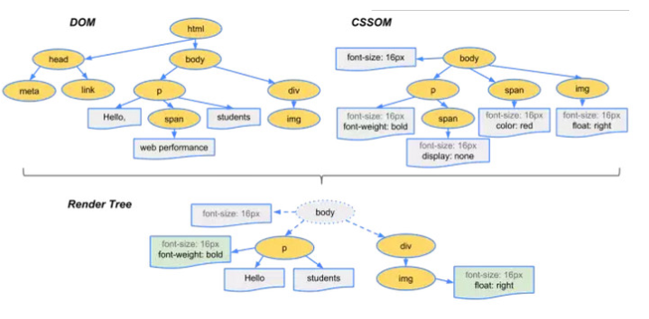

* 谈谈对前端安全的理解,有什么,怎么防范?
```
前端安全问题主要有XSS、CSRF攻击
XSS：跨站脚本攻击,可以理解 为是一种javascript代码注入
XSS的防御措施：
1、过滤和转义用户输入的关键字
2、避免使用evel这种执行方法
3、把cookie设为只读的(httpOnly属性)
CSRF：跨站请求伪造,其实就是网络中的一些提交行为,被黑客利用,在你访问黑客的网站时会被操作到其他网站上
CSRF防御措施：
1、谨慎使用get或post的准则
2、关键请求使用验证码或者token机制
```
* 浏览器渲染过程？
```
<textarea style="height:170px;">
  <!DOCTYPE html>
  <html>
       <head>
             <meta charset="utf-8">
             <link rel="stylesheet"  href="test.css"  type="text/css" />
             <script src="test.js" type="text/javascript"></script>
       </head>
       <body><p>阻塞</p></body>
  </html>
</textarea>
加载是从上到下的,过程中遇到外部css、或者图片资源浏览器都会发送一个请求来获取css、和图片
这些都是异步请求不会影响html文档进行加载
但是当文档加载过程中遇到js时,html文档会被挂起,要等js文件加载完解析完才能恢复html文档
浏览器会将HTML解析成DOM Tree,将CSS解析成CSS Rule Tree，然后根据这两个树来构造渲染树
有了渲染树就能知道网页中有哪些节点、各个节点css及他们的关系,下一步就是Layout,计算出每个节点在屏幕的位置
再下一步就是绘制,即遍历渲染树
这里渲染引擎不会等到所有的html都解析完再去构建渲染树,它是解析一部分显示一部分

```
* Reflow(回流)和Repaint(重绘)
```
回流：当某个部分发生了变化影响布局,那就需要倒回去重新渲染
1、页面初始化的时候。
2、操作DOM时。
3、某些元素尺寸变了。
4、css属性发生变化
重绘：如果只是改变了某个元素的背景颜色、文字颜色,不影响元素周围或内部布局浏览就只会重画某一部分
```
* 在浏览器中输入一个网址发生了什么？
```
1、首先浏览器会根据url查找本地缓存,看是否本地缓存中存在该url的内容,如果没有则继续向下走
2、然后去本地的hosts文件检查是否有相应的域名、IP,根据Windows系统规定如果有则调用这个IP地址映射,如果没有,再去向DNS服务器解析域名。
3、根据查询到的IP、URL向服务器发起TCP连接,进行三次握手
4、然后发起Http请求
5、获取服务器返回的html进行解析
6、然后进行渲染呈现
```
* http状态码
```
1**：信息状态码
2**：成功状态码
3**：重定向状态码
  301：永久重定向
  302：临时重定向
  304：缓存中读取
4**：客户端错误状态码
  400：请求报文中存在语法错误
  401：需要有通过http认证的认证信息
  403：访问被拒绝
  404：页面无法找到
5**：服务器错误状态码
```
* 浏览器缓存机制
```
【浏览器缓存分为强缓存和协商缓存】
  判断强缓存和协商缓存是根据http header里的参数进行判断
  强缓存和协商缓存相同处是：如果命中服务器都不会返回资源,直接从缓存中读取数据
  强缓存和协商缓存不同处是：强缓存不发送请求到服务器,但协商缓存会
  如果上面两个都没有命中,服务器就会将资源发送给客户端
--强缓存
 当客户端第一次问服务器要资源时,服务器丢给客户端所有资源,并告诉客户端,
 将这个资源信息保存在本地,并且在未来的某个时间之前还要的话就直接在本地获取就可以了
 控制缓存时间是用 Expires(1.0规范)和Cache-Control(1.1规范)
--协商缓存
 当客户端第一次问服务器要资源时,服务器丢给客户端所有资源,并告诉客户端,
 将这个资源信息保存在本地,当下次再需要这个资源的时候,一并将这些保存的资源信息发送给服务器,
 由服务器判断这个缓存资源是否需要更新,如果不需求要就直接读本地的,如果需要就会将最新的资源连同相应信息一并返回。
 协商缓存利用 Last-Modified、If-Modified-Since和ETag、If-None-Match来管理
--强缓存的优先级高于协商缓存
【哪些资源不能被缓存】
1、在信息头中设置了Cache-Control不能被缓存
2、经过https安全加密的请求
3、POST请求无法被缓存
```
* 如何优化性能?
```
1、减少http请求
  - 合并js、css、图片
2、html页面优化：减少iframe、避免重定向
3、压缩js、css、html和雪碧图
4、减少对DOM的操作
5、使用http缓存
```
* Https
```
它是一个安全的http数据传输,在HTTP协议的基础上加上SSL安全协议
他的特点是数据加密,客户端和服务器端双方拥有相同的密钥
```
* http协议
```
http是一个基于请求与响应模式、无状态的应用层协议,基于TCP的连接方式
是客户端和服务器端之间数据传输的格式规范简称：超文本传输协议
http请求由三部分组成：分别是请求头、消息报头、请求正文
1、常用的HTTP方法有：get、post、put、head、delete、option
常用的http状态码：1**、2**、3**、4**、5**
```
* Fiddler代理
```
1、有时我们要用Fiddler抓取线上的https网站，但是如果没有证书的话他是不会让你抓取的
这里是一个让你怎么抓取https的教程：https://blog.csdn.net/d1240673769/article/details/74298429
```